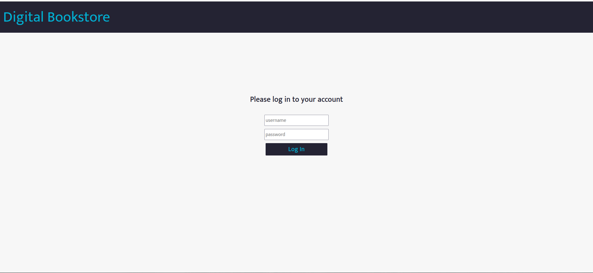
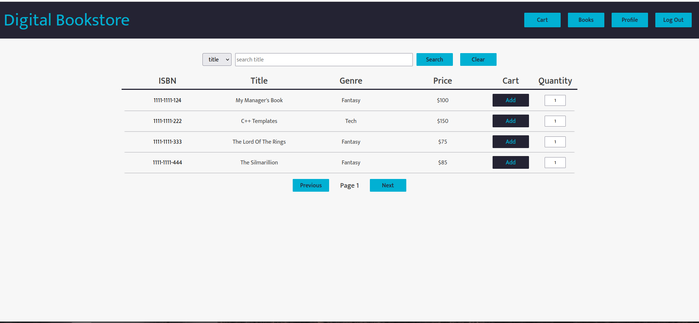
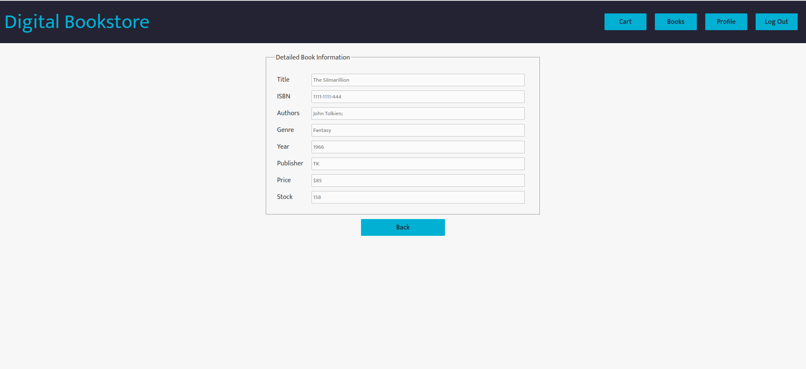
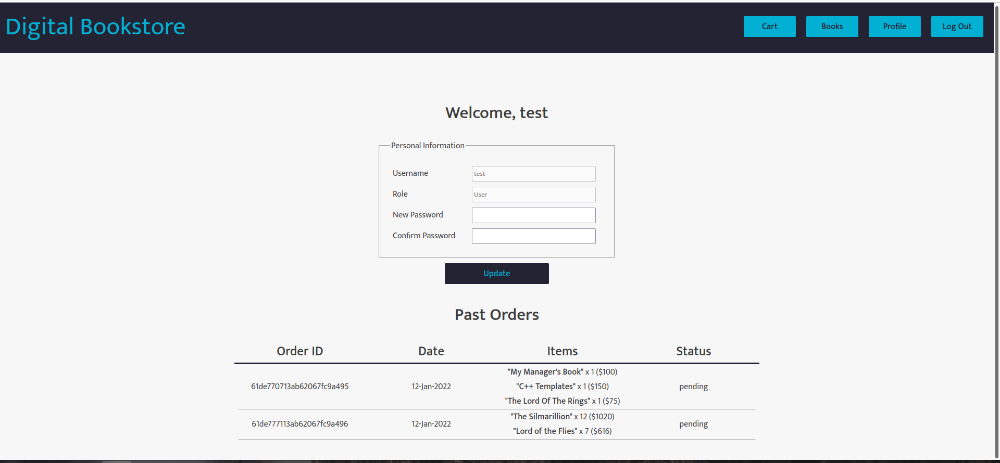
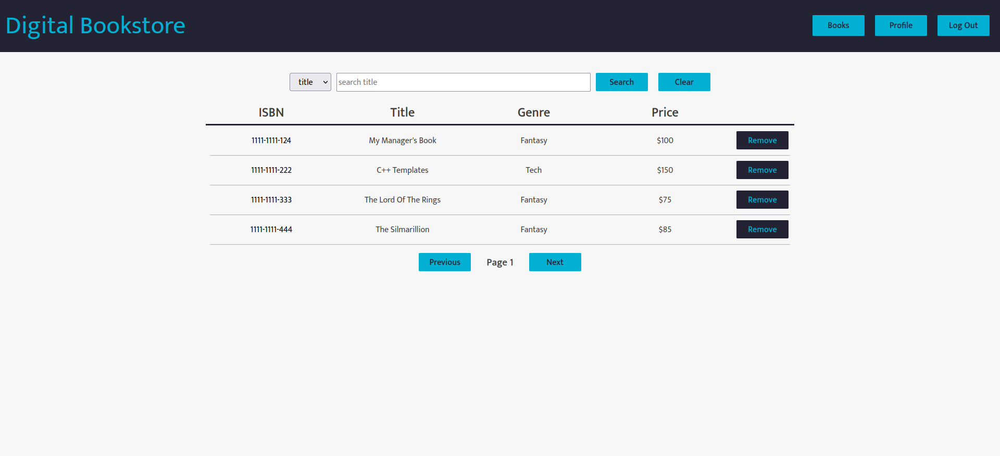
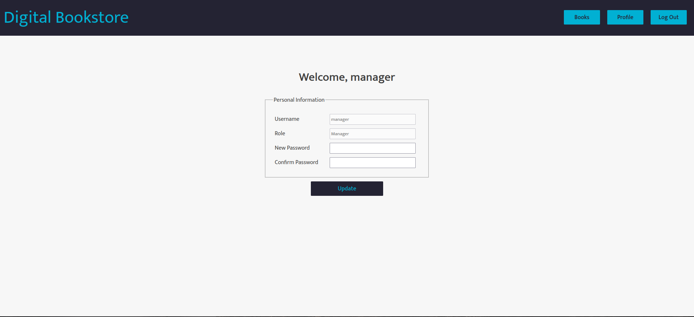
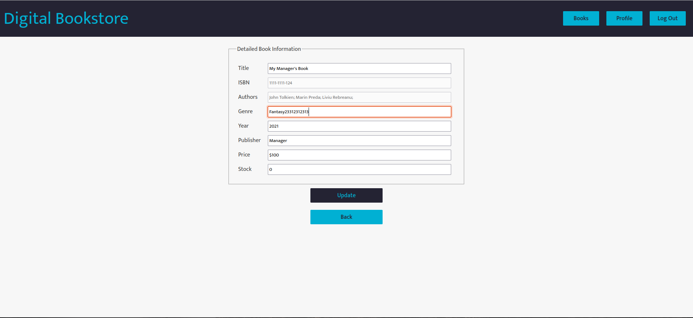
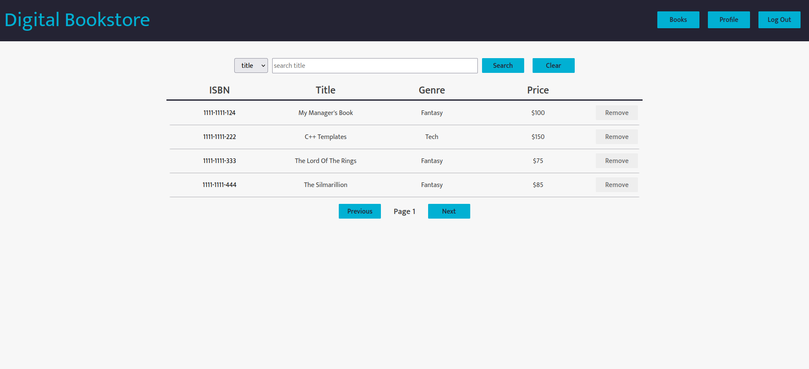
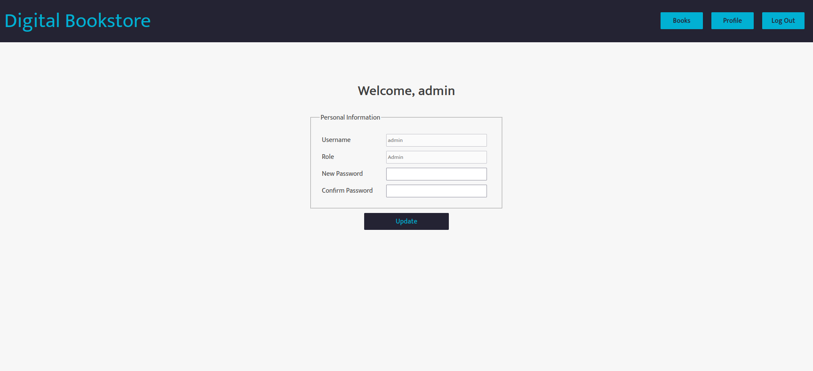

# Digital Book Store Application

This is an application that simulates a book shopping Web Service using 
Spring Boot and React.

The application has the following modules:
* `book-libary` - RESTful service for managing books
* `orders` - RESTful service for managing client orders
* `identity` - SOAP service for authentication/authorization of users
* `shared` - common library for communicating with the SOAP service, also works as a proxy
* `client` - web client for the application written with React

## Steps to run the backend
1. Setup databases:
   * Install MySQL:
     * For the `book-library` module, run `book-library/sql/create_database.sql`
     * For the `idenitity` module, run `identity/sql/create_database.sql`
   * Install MongoDB and setup users
2. Define the following environment variables (in a `.env` file):
    ```dotenv
   # Credentials to get manager-level access to any service
    MANAGER_USERNAME=
    MANAGER_PASSWORD=

    # Environment for book-library module
    BOOK_LIBRARY_DB_NAME=
    BOOK_LIBRARY_DB_USER_NAME=
    BOOK_LIBRARY_DB_USER_PASSWORD=
    
    # Environment for orders module
    ORDERS_HOST=
    ORDERS_PORT=
    ORDERS_DB_NAME=
    ORDERS_DB_AUTH_DB_NAME=
    ORDERS_DB_USER_NAME=
    ORDERS_DB_USER_PASSWORD=
    
    # Environment for identity-management module
    IDENTITY_HOST=
    IDENTITY_PORT=
    IDENTITY_DB_NAME=
    IDENTITY_DB_USER_NAME=
    IDENTITY_DB_USER_PASSWORD=
   
    # Environment for proxy service
    PROXY_PORT=

    # Environment for React App
    CLIENT_HOST=
    CLIENT_PORT=
    ```
3. Run the `identity` module first
4. Compile the `shared` module and **install** it in the local Maven repository
5. Run the other modules

# Screenshots

## Login Page


## Home Page for normal user


## Detailed View of book for normal user


## Profile Page for normal user


## Cart Page for normal user


## Home Page for manager


## Profile Page for manager


## Detailed View of book for manager


## Home Page for admin


## Profile Page for admin


